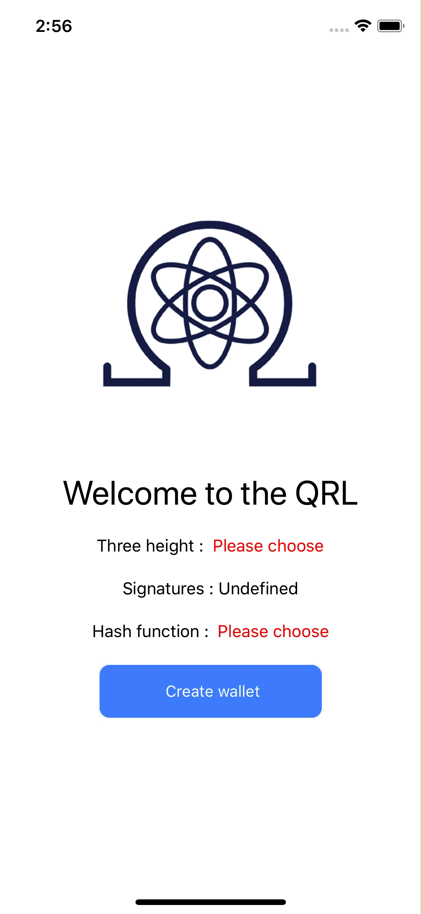

# QRL Mobile wallet

This mobile application is based on the react-native framework to provide an Android and iOS implementation of the QRL wallet.




## General information

The mobile-wallet apps are still under heavy development. Please be aware that frequent changes will occur to this repository.

## Requirements

- Cocoapods (https://cocoapods.org/)
- CMake (https://cmake.org/)
- React-Native (https://facebook.github.io/react-native/)

## How to generate the iOS libraries

To generate the iOS libraries you need to clone the [theQRL/qrllib](https://github.com/theQRL/qrllib) and build the *.a iOS libraries (for the simulator and real device) using Xcode.

```bash
git clone https://github.com/theQRL/qrllib
git submodule update --init --recursive
cd qrllib
mkdir build
cd build
cmake -G Xcode ..
```
These commands will generate a new Xcode project called qrllib.xcodeproj.
Open the Xcode project and build the 4 different libraries (dilithium, kyber, qrllib and shasha) for the iOS simulator and "iOS generic device". You will see all the generated libraries under build/Debug-iphoneos and build/Debug-iphonesimulator directories.

## How to update proto files

In case of any change on the proto file, one needs to regenerate the gRPC pods
```bash
rm -rf Pods
rm Podfile.lock
pod install
```

## Load the generated libraries to the mobile-wallet app

- Open the mobile-wallet Xcode project (ios/theQRL.xcworkspace)
- Click on the project name (theQRL) and select theQRL under the TARGETS list
- Add all the generated .a libraries to the **Linked Frameworks and Libraries section**

## RN <-> native code communication

For more information about the communication between React-Native and native code (Objective-C and c++) check the original [Communication between native and React Native](https://facebook.github.io/react-native/docs/communication-ios.html) documentation.
